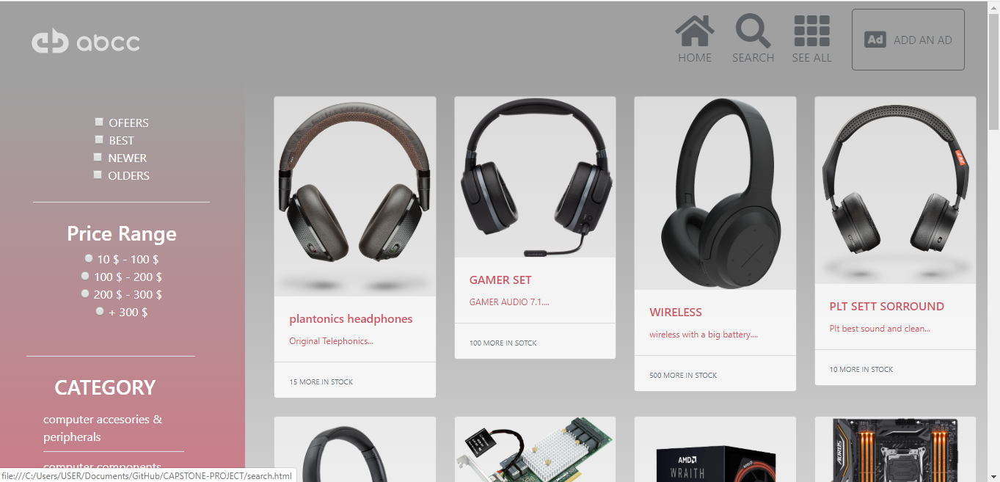

# Capstone project

> It's a real-world-like project, built with business specifications.
it's a project based on a shopping page with 2 pages "index" and "searches", both of them are in the repo.

## Built With

- HTML, CSS.

## Live Demo

[Live Demo Link](https://rawcdn.githack.com/abcussi/CAPSTONE-PROJECT/169deaa796ce92ea02c7f214d7837d1cc6be0b69/index.html)

## Author

👤 **Angel Benjamin Cussi**

- Github: [@githubhandle](https://github.com/abcussi)
- Twitter: [@twitterhandle](https://twitter.com/thecussi)
- Linkedin: [linkedin](https://www.linkedin.com/in/angel-cussi-1b2310174/)

## 🤝 Contributing

Contributions, issues and feature requests are welcome!

Feel free to check the [issues page](issues/).

## Show your support

Give a ⭐️ if you like this project!

## Acknowledgments

- Hat tip to anyone whose code was used
- Inspiration
- etc

